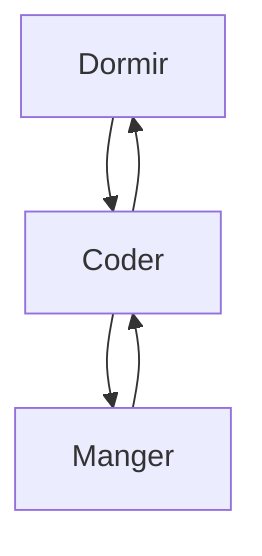

<h1>ToKu | Hugo  </h1>

 Mon prénom est Hugo et j'ai 17 ans. ✨   
Je travaille comme gérant et fondateur au sein du serveur SINIXDEV depuis maintenant 2 ans. 💡   
Je suis Développeur depuis maintenant plus de 2 ans ! 🔥

<h1> En fait  </h1>

 ・ 📡 Je travaille actuellement  sur des nouveaux projets ...   
    ・ 🌱 J'apprends chaque jour de nouvelles choses ...  
    ・ 👯 J'aide les gens au quotidien ...   
    ・ 📂 Mon portefolio s'agrandit de jour en jour ...  
    ・ 💎 Pour me joindre : sinixcompagnypro@gmail.com ... 
  

  
 <h1> Activité récente sur Github </h1>
 

 ・ 🚗 Parking CentralFR (https://github.com/ToKuOFFI/ParkingCentralFR)   
    ・ 🚀 LocalHost FiveM | Mise à jours toutes les 2 semaines (https://github.com/ToKuOFFI/LocalHost  
  

<h1> Mon quotidien </h1>

 

<h1> Nos réseaux </h1>

    🧪 | discord.gg/sinixdev
  

    🔭 | https://www.youtube.com/channel/UCC-t40pbAhyoXQRoRlczKXg

  

    🗞️ | https://www.tiktok.com/@sinixdevofficiel 
    
<h1> Statistiques GitHub </h1>
 

  

    
   
    
